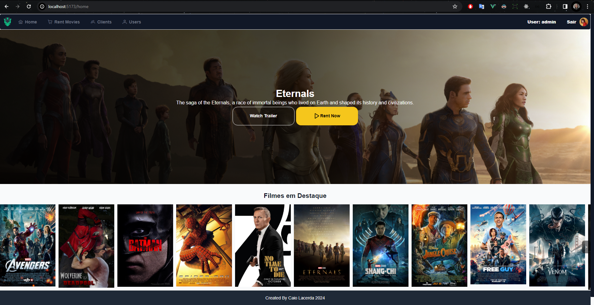
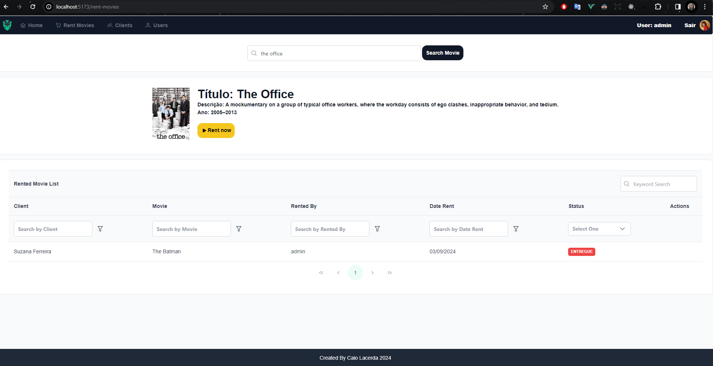

<h1 align="center"></img></h1>

# Loca-movie
O Projeto foi desenvolvido para Locação de filmes com consumo de api do  OMDb (https://www.omdbapi.com/).

O projeto consiste e Pequeno crud de usuarios, clientes, e aluguel de filmes.

# ✋🏻 Pré-requisitos

- [Node.js](https://nodejs.org/en/) ou 
- [Docker](https://docs.docker.com/engine/install/ubuntu/)

## 🚀  Tecnologias

Frontend:
-   [Vuejs](https://vuejs.org/)
-   [Axios](https://github.com/axios/axios)
-   [Tailwindcss](https://tailwindcss.com/)
-   [PrimeVue](https://primevue.org/)

## Começando

<h1 align="center"></img></h1>

## 🔥 Instalação e execução com docker

1. Ter o docker e docker compose instalado
2. executar o comando `docker-compose up -d` na pasta do projeto

frontend : localhost:5173

usuario: admin
senha: admin

## 🔥 Instalação e execução com npm (Sem Docker)

1. Faça um clone desse repositório;
2. Entre na pasta cd loca-movie;
3. Execute `npm install` na pasta frontend para instalar as dependências;
4. Execute `npm run dev` pra startar o projeto;
